# Nythera — Complete Project Documentation

> **Version:** 1.0.0 · **Last Updated:** May 2026 · **Classification:** Confidential — For Investors, Engineers & Auditors

---

## Table of Contents

1. [Executive Summary](#1-executive-summary)
2. [Vision & Mission](#2-vision-mission)
3. [Problem Statement](#3-problem-statement)
4. [User Journey Maps](#4-user-journey-maps)
5. [Product Requirements Document (PRD)](#5-product-requirements-document-prd)
6. [Feature Breakdown](#6-feature-breakdown)
7. [Functional Requirements](#7-functional-requirements)
8. [Non-Functional Requirements](#8-non-functional-requirements)
9. [Information Architecture](#9-information-architecture)
10. [User Flows](#10-user-flows)
11. [Technical Architecture](#11-technical-architecture)
12. [System Design](#12-system-design)
13. [Data Flow Diagrams](#13-data-flow-diagrams)
14. [Security Architecture](#14-security-architecture)
15. [Threat Model](#15-threat-model)
16. [Recovery Process Design](#16-recovery-process-design)
17. [Smart Contract Requirements](#17-smart-contract-requirements)
18. [API Documentation Structure](#18-api-documentation-structure)
19. [Database & Storage Structure](#19-database-storage-structure)
20. [Design System Guidelines](#20-design-system-guidelines)
21. [MVP Scope](#21-mvp-scope)
22. [Audit Requirements](#22-audit-requirements)
23. [Deployment Strategy](#23-deployment-strategy)

## 1. Executive Summary

### Purpose
This document provides a comprehensive technical and business overview of **Nythera**, a decentralized vault for securing and recovering digital secrets. It is intended for investors evaluating the project, engineers onboarding to the codebase, designers understanding the system constraints, and auditors reviewing the security posture.

### What Is Nythera
Nythera is a **zero-knowledge, client-encrypted vault** that enables users to:
- Store seed phrases, private keys, passwords, notes, and files
- Designate trusted guardians for emergency recovery
- Recover secrets via on-chain access control — without exposing the plaintext to any server

All encryption happens **client-side in the browser** using AES-256-GCM via the Web Crypto API. The encrypted payload is stored on-chain via **Story Protocol's Confidential Data Registry (CDR)**, with threshold encryption managed by a decentralized validator network. File attachments are stored on **Walrus**, a decentralized blob storage network.

### Current Status
| Dimension | Status |
|---|---|
| Network | Story Aeneid Testnet (Chain ID 1315) |
| Authentication | Privy (email, wallet) |
| Vault Creation Paths | CDR on-chain |
| Secret Types | Seed phrase, private key, password/PIN, note, file |
| Guardian System | On-chain whitelist + encoded access conditions |
| File Storage | Walrus (encrypted, renewable, up to 4MB) |
| Database | Supabase (metadata only — never stores plaintext) |
| Deployment | Vercel (nythera-beta.vercel.app) |

### Key Differentiators
1. **True zero-knowledge**: Server never sees plaintext. AES keys are never transmitted.
2. **On-chain access control**: Guardian permissions verified by smart contracts — not a centralized API.
3. **No single point of failure**: CDR threshold encryption across a validator network.
4. **Non-custodial by default**: Users retain full ownership. Nythera is the infrastructure, not the custodian.
5. **Multi-modal auth**: Email and Web3 wallets — lowering the Web3 barrier for non-crypto-native guardians.

---

## 2. Vision & Mission

### Vision
**A world where losing access to your digital assets is no longer catastrophic.** Every person who holds cryptocurrency, manages sensitive credentials, or stores critical files should have a decentralized, trustworthy backup — without relying on a single company, server, or paper in a drawer.

### Mission
To build the most secure, human-friendly emergency recovery infrastructure for self-custody users — powered by decentralized cryptography and governed by the people you trust.

### Core Principles

| Principle | Implementation |
|---|---|
| **Zero Knowledge** | AES-256-GCM encryption in-browser. Server stores ciphertext only. |
| **User Sovereignty** | Vault owners control who can recover. No admin override. No backdoor. |
| **Guardian Simplicity** | Non-technical guardians (family, friends) can participate via email login + Privy embedded wallets. |
| **Progressive Decentralization** | Testnet → Mainnet → DAO governance → Open protocol. |
| **Defense in Depth** | Multiple encryption layers (AES + CDR threshold + ECDH per-guardian). Key bytes zeroed after use. |

---

## 3. Problem Statement

### The Core Problem
**Self-custody of digital assets creates a single point of failure: the owner.**

When a crypto holder loses their seed phrase, forgets a password, or becomes incapacitated, there is no "forgot password" button. The assets are gone — permanently.

### Problem Dimensions

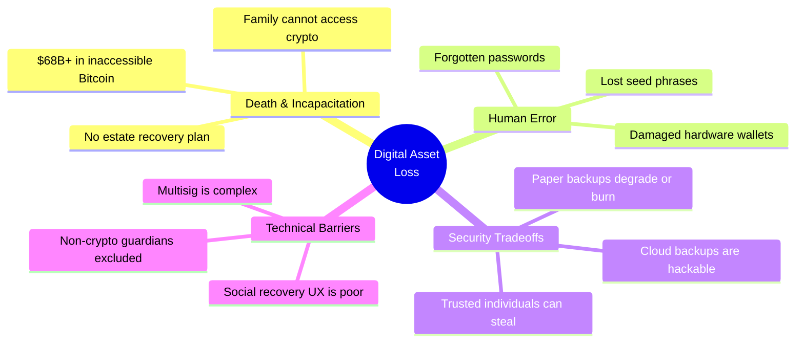

### Current Solutions — And Why They Fail

| Solution | Weakness |
|---|---|
| Paper backup in a safe | Fire, flood, theft, ink fading |
| Cloud storage (Google Drive, iCloud) | Centralized target, server-side readable |
| Hardware wallet only | Single device failure = total loss |
| Multisig wallets | Complex setup, all parties must be crypto-literate |
| Custodial solutions (exchanges) | "Not your keys, not your coins" — counterparty risk |
| Social recovery (existing) | Poor UX, requires all guardians to coordinate simultaneously |

### Assumptions
- Users value self-custody but fear permanent key loss
- Non-technical family members are the most common desired recovery contacts
- Existing solutions force users to choose between security and recoverability

### Edge Cases
- User dies without informing guardians about vault existence
- Guardian changes wallet address after being registered
- Multiple guardians collude to access vault without owner consent

---

## 4. User Journey Maps

### Journey 1: First-Time Vault Creation

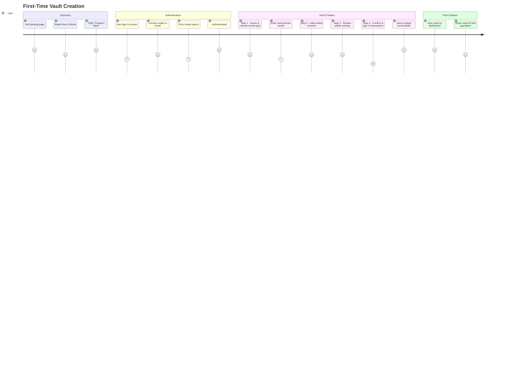

### Journey 2: Emergency Recovery

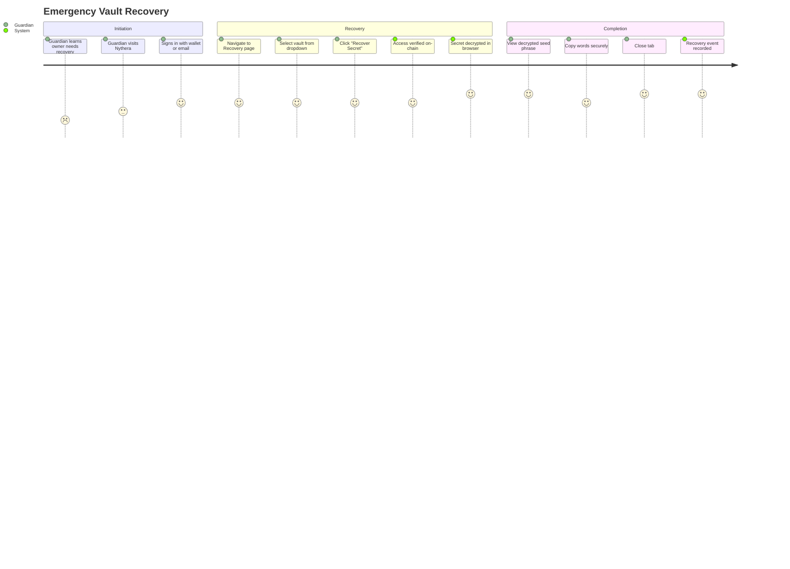

---

## 5. Product Requirements Document (PRD)

### Product Name
**Nythera** — Decentralized Recovery Vaults

### Problem Statement
Self-custody users have no reliable, decentralized, and user-friendly method to back up and recover their most sensitive digital credentials — without introducing centralized risk or requiring all parties to be crypto-literate.

### Product Goals
1. Enable zero-knowledge encrypted backup of any secret type
2. Provide on-chain guardian-based recovery with no single point of failure
3. Lower the barrier for non-technical guardians via email login + embedded wallets
4. Maintain a premium, polished UX that inspires trust

### Success Criteria
- Users can create a vault and recover it within 5 minutes
- Zero plaintext ever leaves the browser
- Guardian onboarding requires no prior crypto knowledge
- System functions correctly with ≥1 guardian

### Constraints
- All encryption must be client-side (Web Crypto API)
- No server-side key storage — ever
- Must work on Story Aeneid Testnet (mainnet migration planned)
- File uploads capped at 4MB (Walrus limitation)
- 3 wallet confirmations required for CDR vault creation

### Dependencies
- Story Protocol CDR SDK (`@piplabs/cdr-sdk`)
- Privy authentication infrastructure
- Walrus decentralized storage network
- Supabase for metadata persistence
- Story Aeneid Testnet RPC availability

---

## 6. Feature Breakdown

### Feature Matrix

| Feature | Description | Status | Priority |
|---|---|---|---|
| **Vault Creation Wizard** | 4-step guided flow: name/secret → contacts → safety → confirm | ✅ Shipped | P0 |
| **5 Secret Types** | Seed phrase (12/24), private key, password/PIN, note, file | ✅ Shipped | P0 |
| **CDR On-Chain Storage** | Encrypted data stored via Story Protocol CDR with threshold encryption | ✅ Shipped | P0 |
| **Guardian Whitelist** | On-chain access control via WhitelistCondition smart contract | ✅ Shipped | P0 |
| **Vault Recovery** | 4-step recovery flow with on-chain access verification | ✅ Shipped | P0 |
| **Dashboard** | Vault grid with search, filter, health metrics, storage credits | ✅ Shipped | P0 |
| **Privy Auth** | Email and wallet login with embedded wallet creation | ✅ Shipped | P0 |
| **Guardian Management** | Add/remove guardians post-creation with on-chain updates | ✅ Shipped | P1 |
| **File Backup (Walrus)** | Encrypted file upload/download with renewal management | ✅ Shipped | P1 |
| **Recovery History** | Per-vault log of who recovered and when | ✅ Shipped | P1 |
| **Storage Credits** | 2 free credits, ledger-tracked spending | ✅ Shipped | P1 |
| **Email Notifications** | Vault invite, expiry warning, renewal status emails | ✅ Shipped | P2 |
| **Wallet Management** | Balance display, testnet faucet links, embedded wallet creation | ✅ Shipped | P1 |
| **Auto-Renewal Cron** | Automated Walrus storage renewal via cron endpoint | ✅ Built | P2 |

### Vault Creation — Detailed Feature Breakdown

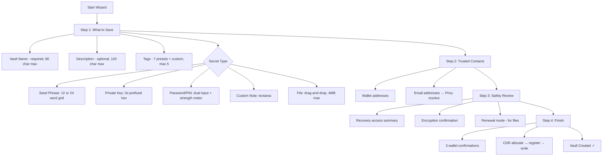

---

## 7. Functional Requirements

### FR-01: Client-Side Encryption
- All secret data MUST be encrypted in the browser before any network transmission
- Encryption algorithm: AES-256-GCM via Web Crypto API
- 12-byte random IV generated per encryption operation
- GCM authentication tag provides integrity verification
- AES key bytes MUST be zeroed (`zeroBytes()`) after use in `finally` blocks

### FR-02: CDR Vault Lifecycle
- Vault allocation MUST generate a unique UUID on-chain
- Access conditions MUST be registered before data write
- Encrypted data write MUST include `writeFee` payment
- Three wallet confirmations required: allocate, register, write
- Recovery MUST verify on-chain whitelist before decryption

### FR-03: Guardian Management
- Owner wallet MUST always be whitelisted
- Guardians can be added by wallet address or email
- Email guardians are resolved to wallets via Privy's `/api/privy/resolve`
- Guardian additions/removals MUST be reflected on-chain (smart contract calls)
- Guardian changes MUST also update Supabase metadata

### FR-04: Recovery Flow
- Recovery requires wallet connection
- On-chain access verification before CDR decryption attempt
- Decrypted content displayed in-browser only — never persisted
- Recovery event recorded in both localStorage and Supabase
- Timeout: 120 seconds for CDR access operation

### FR-05: File Backup
- Maximum file size: 4MB
- Supported types: images, PDFs, text files
- File encrypted with random AES-256-GCM key + IV (separate from CDR)
- Encryption key/IV stored as hex in vault payload JSON (which is itself CDR-encrypted)
- Encrypted blob uploaded to Walrus
- Renewal modes: manual notification or auto-renew via credits

### FR-06: Vault Metadata
- Name: required, max 80 characters
- Description: optional, max 120 characters
- Tags: max 5, each max 28 characters, from 7 presets or custom
- Status: `active` | `locked` | `recovering`
- Content type: `text` | `walrus-file`

### FR-07: Authentication
- Two login methods: email, wallet connect
- Embedded wallet auto-created for email users
- Privy handles key management for embedded wallets
- App layout gated behind authentication check

---

## 8. Non-Functional Requirements

### NFR-01: Security
| Requirement | Standard |
|---|---|
| Encryption at rest | AES-256-GCM (NIST approved) |
| Key derivation | Web Crypto API `generateKey()` with extractable flag |
| Key zeroing | All key material zeroed in `finally` blocks |
| No server-side keys | Zero plaintext or key material on any server |
| Access control | On-chain smart contracts (no centralized check) |

### NFR-02: Performance
| Metric | Target |
|---|---|
| Vault creation | < 30 seconds (including 3 wallet confirmations) |
| Vault recovery | < 15 seconds (after wallet confirm) |
| Dashboard load | < 2 seconds (cached vaults) |
| File encryption | < 5 seconds for 4MB file |
| CDR access timeout | 120 seconds max |

### NFR-03: Availability
| Metric | Target |
|---|---|
| Application uptime | 99.5% (Vercel SLA) |
| CDR network availability | Dependent on Story Protocol validators |
| Walrus storage availability | Dependent on Walrus network |
| Supabase availability | 99.9% (Supabase SLA) |

### NFR-04: Scalability
- Stateless Next.js deployment on Vercel (auto-scaling)
- Supabase handles database scaling
- CDR and Walrus are decentralized — scale with network
- localStorage cache prevents redundant RPC calls

### NFR-05: Accessibility & Responsiveness
- Fully responsive design (phone, tablet, desktop)
- Mobile sidebar as slide-out drawer
- `prefers-reduced-motion` support in CSS animations
- Semantic HTML with ARIA attributes on interactive elements

### NFR-06: Graceful Degradation
- All Supabase features degrade gracefully if env vars missing (`skipped: true`)
- Privy shows clear error if `NEXT_PUBLIC_PRIVY_APP_ID` absent
- Vault list falls back to localStorage if Supabase unavailable

---

## 9. Information Architecture

### Site Map

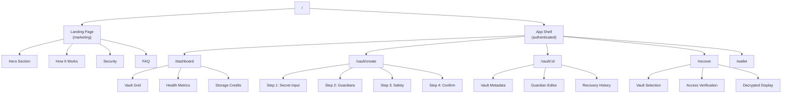

### Navigation Structure
| Level | Element | Route |
|---|---|---|
| Sidebar (primary) | Dashboard | `/dashboard` |
| Sidebar | Create Vault | `/vault/create` |
| Sidebar | Recovery | `/recover` |
| Sidebar | Wallet | `/wallet` |
| Top bar | Create Vault (CTA) | `/vault/create` |
| Top bar | Wallet Button | Privy modal |
| Dashboard | Vault Card → Detail | `/vault/[id]` |
| Landing | Launch App | `/dashboard` |
| Landing | Create a Vault | `/vault/create` |

---

## 10. User Flows

### Flow 1: Vault Creation (CDR Path)

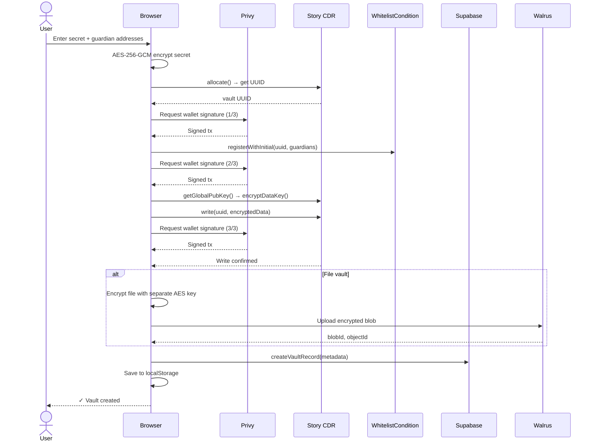

### Flow 2: Vault Recovery

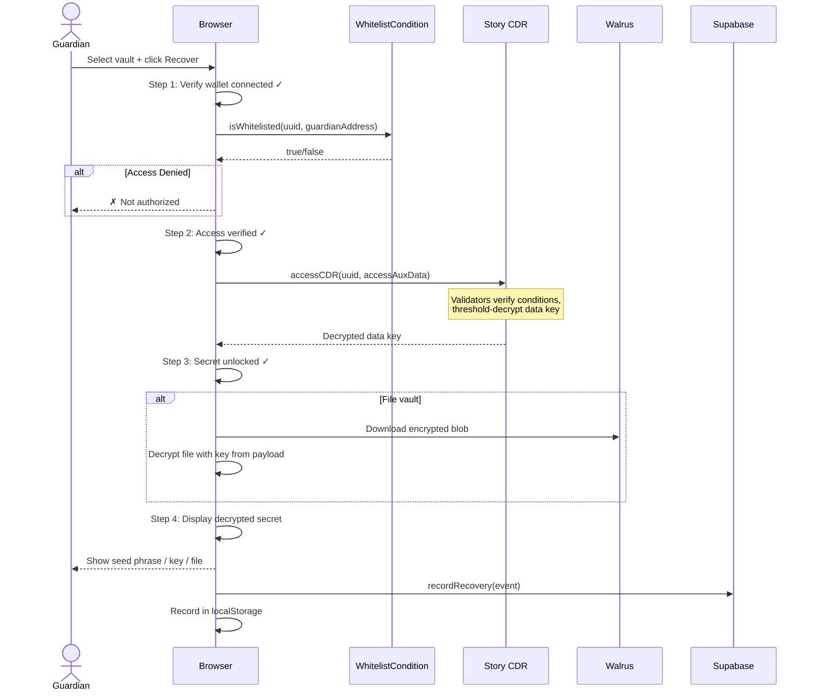

---

## 11. Technical Architecture

### High-Level Architecture

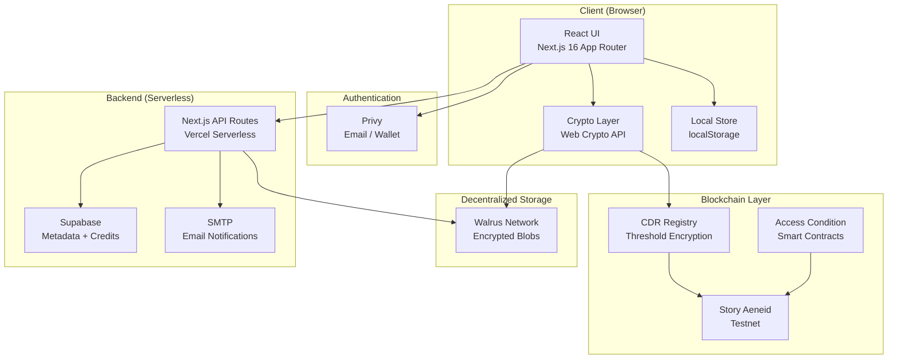

### Technology Stack

| Layer | Technology | Version | Purpose |
|---|---|---|---|
| Framework | Next.js | 16.2.6 | App Router, SSR, API routes |
| UI | React | 19.2.4 | Component rendering |
| Styling | Tailwind CSS | 4.x | Utility-first CSS |
| Animation | Framer Motion | 12.40.0 | Page transitions, micro-animations |
| Auth | Privy | 3.27.1 | Email/wallet auth + embedded wallets |
| Database | Supabase | 2.106.1 | Metadata, credits, notifications |
| Server State | TanStack React Query | 5.100.11 | Async state management |
| Blockchain Client | viem | 2.50.4 | Ethereum JSON-RPC |
| React Hooks (Web3) | wagmi | 3.6.15 | React hooks for blockchain |
| CDR | @piplabs/cdr-sdk | 0.2.1 | Story Protocol CDR integration |
| Secret Sharing | shamir-secret-sharing | 0.0.4 | Shamir SSS (Cure53 audited) |
| Email | Nodemailer | 8.0.7 | SMTP email delivery |
| Deployment | Vercel | — | Serverless hosting |

---

## 12. System Design

### Component Architecture

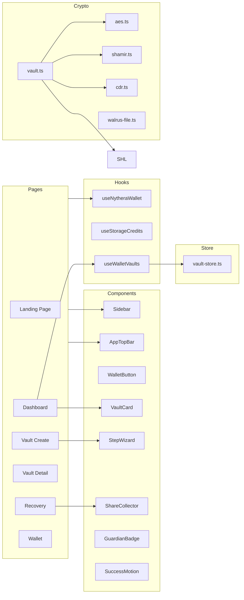

### Data Flow: Local-First with Remote Sync

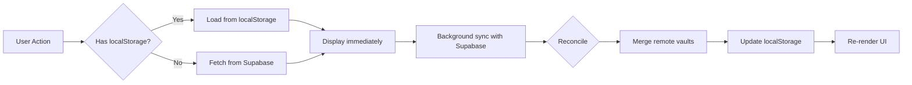

---

## 13. Data Flow Diagrams

### DFD Level 0: System Context

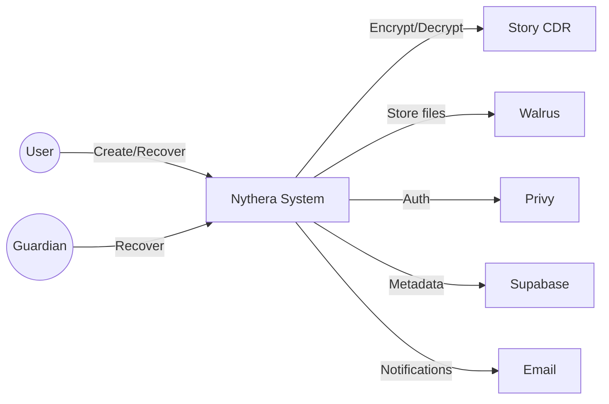

### DFD Level 1: Vault Creation

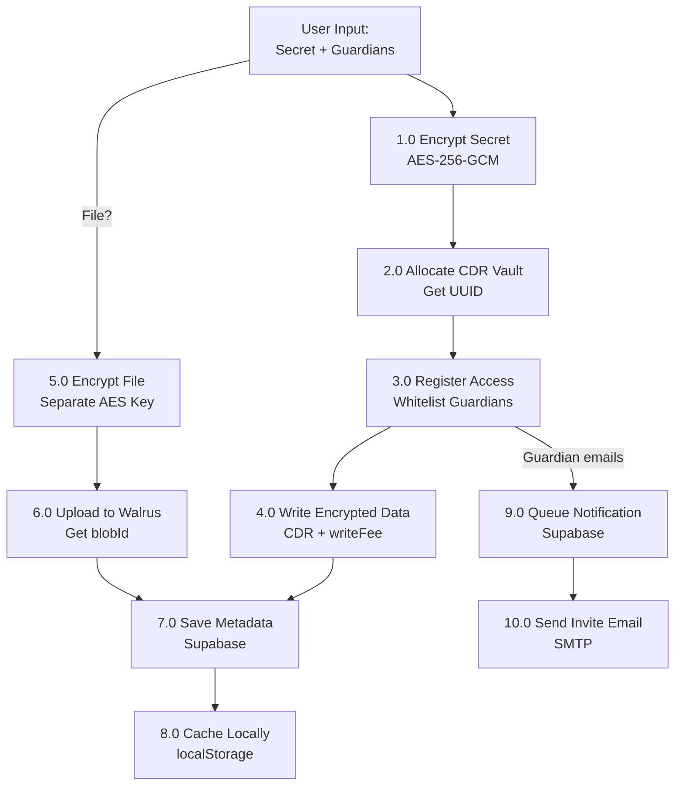

### DFD Level 1: Vault Recovery

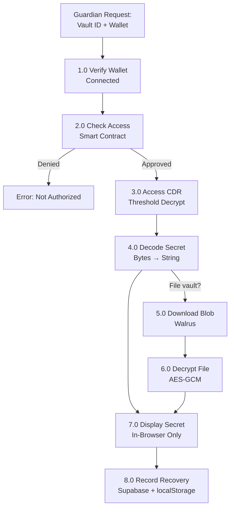

---

## 14. Security Architecture

### Defense-in-Depth Model

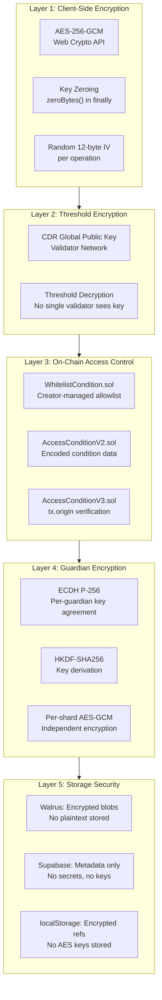

### Encryption Specifications

| Component | Algorithm | Key Size | IV/Nonce | Auth |
|---|---|---|---|---|
| Vault secret | AES-256-GCM | 256 bits | 12 bytes (random) | GCM tag |
| File backup | AES-256-GCM | 256 bits | 12 bytes (random) | GCM tag |
| CDR threshold | CDR global key | Network-defined | UUID-based label | Validator consensus |

### Key Material Lifecycle

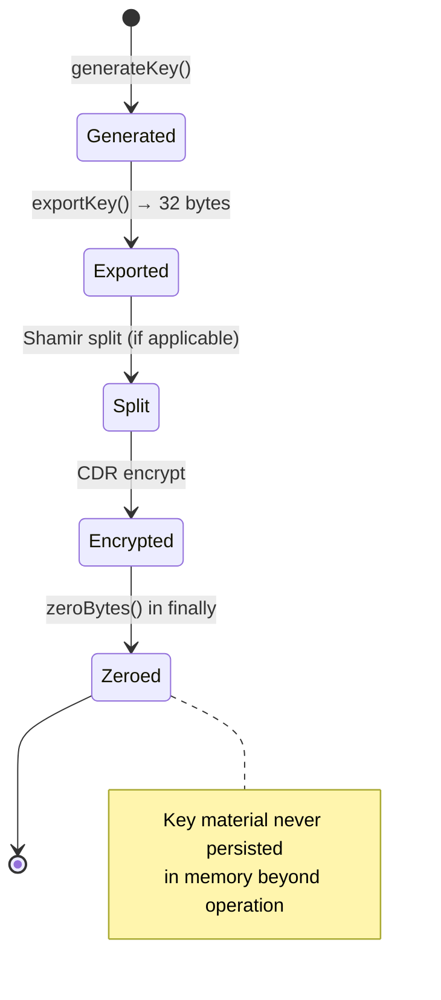

---

## 15. Threat Model

### STRIDE Analysis

| Threat | Category | Description | Mitigation |
|---|---|---|---|
| **T-01** | Spoofing | Attacker impersonates guardian wallet | On-chain whitelist verification. Wallet signature required. |
| **T-02** | Tampering | Modified ciphertext | AES-GCM auth tag detects tampering. Decryption fails. |
| **T-03** | Repudiation | Guardian denies recovery | Recovery events logged in Supabase with wallet address + timestamp. |
| **T-04** | Information Disclosure | Server reads plaintext | Impossible — encryption is client-side. Server only sees ciphertext. |
| **T-05** | Information Disclosure | CDR validator reads secret | CDR uses threshold encryption — no single validator sees the full key. |
| **T-06** | Denial of Service | CDR network unavailable | 120-second timeout with retry guidance. Vault metadata still accessible. |
| **T-07** | Elevation of Privilege | Non-guardian accesses vault | Smart contract enforces whitelist. No server-side bypass. |
| **T-08** | Elevation of Privilege | Admin reads vault contents | No admin key exists. Supabase stores metadata only. |

### Attack Surface

| Surface | Risk | Controls |
|---|---|---|
| Browser (client) | XSS could exfiltrate decrypted secret | CSP headers, React DOM escaping, no `dangerouslySetInnerHTML` |
| API routes | Unauthorized metadata access | Supabase RLS (Row Level Security), wallet-scoped queries |
| Smart contracts | Whitelist bypass | Formal verification planned, admin-free design |
| Supabase | Data breach | Contains no secrets — only metadata, tags, recipient lists |
| Walrus | Blob exfiltration | Blobs are AES-encrypted. Useless without key (stored in CDR). |
| Privy | Account takeover | Privy handles auth security. Embedded wallet keys secured by Privy infra. |

### Risk: Malicious or Compromised Guardian
- **Scenario**: A single malicious or compromised guardian recovers the vault without the owner's consent.
- **Current mitigation**: Owner is alerted via recovery history. Owner can remove guardians. Because Nythera uses a 1-of-N access model (any single guardian can decrypt), careful guardian selection is paramount.
- **Future mitigation**: Timelock delay before recovery completes (planned feature)
- **Assumption**: Owner trusts their selected guardians completely — this is a social trust model by design.

### FAQ: Guardian Access
**Q: Do all my guardians need to approve a recovery together?**
**A:** No. Nythera currently operates on a 1-of-N model. This means that *any single guardian* you add to your vault can independently trigger a recovery. You should only add individuals you trust implicitly with complete access to your vault.

---

## 16. Recovery Process Design

### Recovery Architecture

The recovery process is the **most critical user flow** in Nythera. It must be reliable, secure, and simple enough for a grieving family member or a stressed team lead.

### The Recovery Path

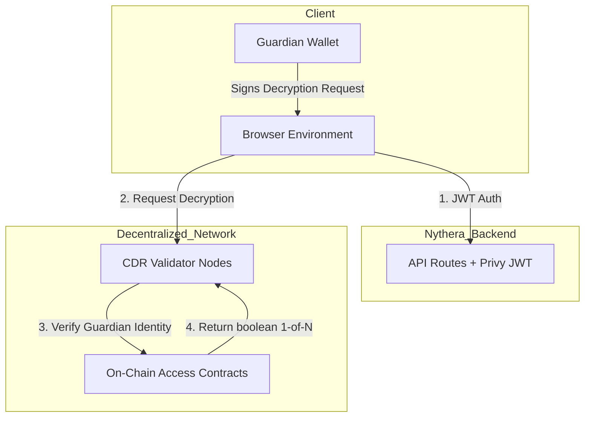

### CDR Recovery Flow (Primary — Production Path)

| Step | Action | Verification |
|---|---|---|
| 1. Wallet Connected | Guardian connects wallet via Privy | `useNytheraWallet()` returns address |
| 2. Access Verified | Smart contract `isWhitelisted(uuid, address)` called | Returns `true` or recovery blocked |
| 3. Secret Unlocked | `accessSecretFromCDR()` → CDR validators threshold-decrypt | 120s timeout, retry on failure |
| 4. Secret Displayed | Decoded bytes → string, auto-detected as seed/key/note | Displayed in-browser only |

### Post-Recovery Security
- Secret is **never persisted** — exists only in React state
- Warning displayed: "Close this tab when done. Never screenshot your seed phrase."
- Recovery event recorded with: `recoveredAt`, `recoveredBy` (wallet address), `cdrUuid`, `contentType`
- "Done — close this page" button provided

### File Recovery Additional Steps
1. Download encrypted blob from Walrus by `blobId` (fallback to `objectId`)
2. Parse `WalrusFilePayload` JSON from CDR-decrypted data
3. Decrypt file ciphertext with embedded AES key + IV
4. Display image preview (if image type) or download link

### Edge Cases
| Case | Handling |
|---|---|
| Walrus blob expired | Recoverability check fails pre-recovery. User sees "not recoverable" status. |
| CDR timeout | Retry button provided. Error message with "try again in a few moments." |
| Wrong wallet | Clear message: "This wallet is not allowed to recover this vault." |
| Guardian wallet changed | Owner must update guardian list on vault detail page |
| Vault deleted | No CDR data to access. Recovery impossible. |

---

## 17. Smart Contract Requirements

### Deployed Contracts

#### WhitelistCondition.sol (v1)
- **Purpose**: Simple allowlist-based CDR read/write access control
- **Solidity**: 0.8.26
- **Network**: Story Aeneid Testnet

| Function | Access | Description |
|---|---|---|
| `register(uuid)` | Public | Creator registers, auto-whitelisted |
| `registerWithInitial(uuid, addresses[])` | Public | Creator + batch-whitelist |
| `addToWhitelist(uuid, address)` | Creator only | Add guardian |
| `removeFromWhitelist(uuid, address)` | Creator only | Remove guardian |
| `checkReadCondition(uuid, ..., caller)` | View | Returns `isWhitelisted[uuid][caller]` |
| `checkWriteCondition(uuid, ..., caller)` | View | Returns `isWhitelisted[uuid][caller]` |
| `isWhitelisted(uuid, address)` | View | Direct lookup |
| `vaultCreator(uuid)` | View | Returns creator address |

#### AccessConditionV2.sol (v2-encoded-access)
- **Purpose**: Condition data encoded at allocation — not stored in contract
- **Condition data format**: `abi.encode(creatorAddress, initialReaders[])`

| Function | Description |
|---|---|
| `checkReadCondition(conditionData, caller)` | Check if caller is creator, initial reader, or has override |
| `checkWriteCondition(conditionData, caller)` | Only creator can write |
| `setAccessOverride(conditionData, account, bool)` | Creator can add/remove access overrides |
| `getAccessOverride(conditionData, account)` | Read override status |

#### AccessConditionV3.sol (v3-origin-access)
- **Purpose**: Same as V2 but uses `tx.origin` for CDR-compatible overloads
- **Rationale**: When CDR contract calls the condition check, `msg.sender` is CDR — not the user. `tx.origin` resolves this.

### Contract Security Requirements
- [ ] No `selfdestruct` capability
- [ ] Creator-only mutation functions
- [ ] No upgrade proxy (immutable logic)
- [ ] Formal verification recommended pre-mainnet
- [ ] Gas optimization for batch operations

---

## 18. API Documentation Structure

### API Authorization
All backend routes are protected by a server-side authentication middleware (`withAuth`). Clients must pass a valid Privy JWT in the `Authorization: Bearer <token>` header. The backend strictly ignores client-provided wallet identities in request bodies or query parameters, deriving ownership securely from the JWT.

### Endpoints

#### `POST /api/vault-records`
**Purpose**: Create a vault metadata record
* **Auth**: Required (Bearer JWT)
* **Body**: `{ vault: VaultData }` *(Note: `creatorWallet` is securely injected by middleware)*
**Response**: `{ id, created_at }` or `{ skipped: true }` if Supabase unconfigured.

---

#### `GET /api/vault-records`
**Purpose**: List all vaults accessible to the authenticated wallet (owned + shared)
* **Auth**: Required (Bearer JWT)
**Response**: `{ vaults: VaultData[] }` with recoverability checks.

---

#### `DELETE /api/vault-records`
**Purpose**: Delete a vault record
* **Auth**: Required (Bearer JWT)
* **Body**: `{ cdrUuid: number }` or `{ localVaultId: string }`

---

#### `PATCH /api/vault-recipients`
**Purpose**: Update guardian/recipient list for a vault
* **Auth**: Required (Bearer JWT)
* **Body**: `{ vaultId: string, recipients: object }`

---

#### `POST /api/vault-recoveries`
**Purpose**: Record a recovery event
* **Auth**: Required (Bearer JWT)
* **Body**: `{ localVaultId: string, cdrUuid: number, contentType: string }`

---

#### `GET /api/storage/credits`
**Purpose**: Query storage credit balance for the authenticated wallet
* **Auth**: Required (Bearer JWT)
**Response**: `{ credits: number }`

---

#### `POST /api/storage/walrus/upload`
**Purpose**: Upload encrypted file to Walrus

**Response**: `{ blobId, objectId, endEpoch }`

---

#### `GET /api/storage/walrus/download/[blobId]`
**Purpose**: Download encrypted file from Walrus

---

#### `POST /api/privy/resolve`
**Purpose**: Resolve email addresses to wallet addresses via Privy

---

#### `GET /api/setup/status`
**Purpose**: Check environment configuration (Supabase, Privy, CDR)

---

#### Cron Endpoints
| Endpoint | Schedule | Purpose |
|---|---|---|
| `POST /api/cron/notifications` | Periodic | Process pending email notifications |
| `POST /api/cron/renewals` | Periodic | Auto-renew expiring Walrus storage |

---

#### Admin Endpoints
| Endpoint | Purpose |
|---|---|
| `POST /api/admin/credits/grant` | Grant storage credits to a wallet |
| `GET /api/admin/recoveries` | List all recovery events (admin view) |

---

## 19. Database & Storage Structure

### Supabase Schema

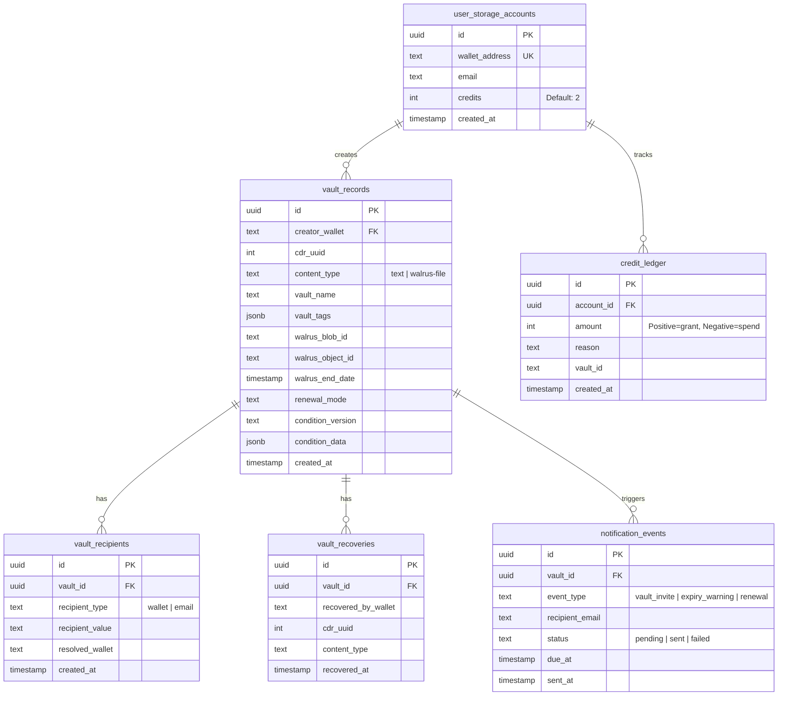

### localStorage Schema

| Key Pattern | Contents | Stored Secrets? |
|---|---|---|
| `nythera_vaults_{wallet}` | Array of VaultData (metadata, CDR refs, tags, guardian lists) | **Never** — no keys, no plaintext |

### Walrus Storage
| Data | Encrypted? | Accessible By |
|---|---|---|
| File blobs | ✓ AES-256-GCM | Anyone with blobId — but useless without decryption key |
| Decryption key | Stored inside CDR payload | Only whitelisted wallets via CDR threshold decrypt |

---

## 20. Design System Guidelines

### Color Palette

| Token | Hex | Role |
|---|---|---|
| `offwhite` | `#F5F0E8` | Primary background |
| `ink` | `#1A1A1A` | Primary text |
| `warm-clay` | `#C4956A` | Primary accent, CTAs, hover states |
| `muted-gold` | `#C9A96E` | Highlights, decorative elements |
| `charcoal` | `#2C2C2C` | Dark backgrounds |
| `sage` | `#C8D5B9` | Success states, wallet connected |
| `dusty-rose` | `#D4B8A8` | Warm section backgrounds |
| `slate-blue` | `#8FA3B1` | Cool section backgrounds |
| `pale-teal` | `#A8C5C0` | Secondary accents |
| `lavender-grey` | `#B8B2CC` | Tertiary accents |

### Typography

| Token | Font Family | Usage |
|---|---|---|
| `--font-display` | Bricolage Grotesque | Headings, titles |
| `--font-body` | Poppins | Body text, descriptions |
| `--font-mono` | JetBrains Mono | Labels, addresses, code |
| `--font-cinzel` | Bricolage Grotesque (alias) | Logo wordmark |

### Component Library

| Component | Class | Description |
|---|---|---|
| Panel | `.ny-panel` | Glassmorphic card — `backdrop-blur(16px)`, gold gradient top border, ambient shadow |
| Tile | `.ny-tile` | Lighter glass card — no shadow |
| Modal | `.ny-modal` | Opaque overlay card |
| Button (primary) | `.ny-button` | Ink background → warm-clay on hover, shadow lift |
| Button (secondary) | `.ny-button-secondary` | Transparent with ink border |
| Button (danger) | `.ny-button-danger` | Dusty-rose with red tint |
| Input | `.ny-input` | Transparent background, warm-clay focus ring |
| Label | `.ny-label` | Monospace uppercase micro-label (10px, tracking 0.14em) |
| Heading | `.ny-heading` | Display font, tight tracking |
| Pill | `.ny-pill` | Rounded badge for tags |
| Divider | `.ny-divider` | Gradient separator line |
| Success | `.ny-success-mark` | Animated checkmark with ring expansion |

### Animation System
- 15+ keyframes including: `fadeInUp`, `fadeInDown`, `float`, `shimmer`, `marquee`
- Vault-specific: `vaultCorePulse`, `orbitSpin`, `particleDrift`
- Success feedback: `successPop`, `successRing`, `successSweep`
- `prefers-reduced-motion` support: all animations disabled for accessibility

### Design Principles
1. **Premium minimalism** — Generous whitespace, muted palette, glassmorphism
2. **Ambient warmth** — SVG noise texture overlay, gradient accents, gold highlights
3. **Trust through craft** — Smooth transitions, consistent micro-interactions
4. **Information hierarchy** — Mono labels → display headings → body descriptions

---

## 21. MVP Scope

### MVP Definition
The Minimum Viable Product is the current deployed version at `nythera-beta.vercel.app`, targeting the Story Aeneid Testnet.

### In Scope (MVP) ✅

| Category | Features |
|---|---|
| **Vault Creation** | 4-step wizard, 5 secret types, CDR on-chain storage |
| **Guardian System** | Wallet + email guardians, on-chain whitelist |
| **Recovery** | CDR-based recovery with access verification |
| **Dashboard** | Vault grid, search, filter, health metrics |
| **Authentication** | Email, wallet via Privy |
| **File Backup** | Encrypted upload to Walrus (4MB max, 2 free credits) |
| **Guardian Management** | Post-creation add/remove with on-chain updates |
| **Recovery History** | Per-vault recovery event log |
| **Wallet Page** | Balance, embedded wallet creation, faucet links |

### Out of Scope (MVP) ❌

| Feature | Reason | Phase |
|---|---|---|
| Timelock delay | Requires additional smart contract development | v1.1 |
| Multi-chain support | Story mainnet first, then expand | v1.2 |
| Mobile app | Web-first, PWA later | v2.0 |
| DAO governance | Premature for testnet phase | v3.0 |
| Hardware wallet signing | Privy handles wallet abstraction | v1.1 |
| Vault sharing/transfer | Complex ownership model | v2.0 |
| Dead man's switch | Requires oracle integration | v2.0 |
| Biometric authentication | Platform-dependent | v2.0 |

---

## 22. Audit Requirements

### Smart Contract Audit

| Scope | Contract | Priority |
|---|---|---|
| WhitelistCondition.sol | Access control logic, creator authorization | **P0** |
| AccessConditionV2.sol | Encoded condition parsing, override mechanism | **P0** |
| AccessConditionV3.sol | tx.origin usage security implications | **P0** |
| CDR integration | Interaction patterns with CDR SDK contracts | **P1** |

**Required Checks:**
- [ ] Reentrancy protection
- [ ] Integer overflow/underflow (Solidity 0.8.26 — built-in)
- [ ] Access control bypass paths
- [ ] Front-running vulnerabilities
- [ ] Gas griefing attacks
- [ ] `tx.origin` phishing (V3 — documented design choice)
- [ ] Storage collision in upgradeable patterns (N/A — immutable)

### Cryptographic Audit

| Component | Audit Focus |
|---|---|
| AES-256-GCM implementation | Correct IV generation, key handling, zeroing |
| Shamir SSS usage | Threshold correctness, share integrity |
| CDR encryption | Correct use of global public key, label handling |
| File encryption | Key/IV separation from vault encryption |

### Application Security Audit

| Area | Checks |
|---|---|
| XSS Prevention | CSP headers, input sanitization, DOM escaping |
| API Authorization | Wallet-scoped queries, no unauthenticated access |
| Dependency Audit | `npm audit`, known vulnerability scan |
| Secret Management | No keys in env vars beyond config, no logging of secrets |
| CORS Configuration | API route access restrictions |

### Recommended Audit Firms
1. **Trail of Bits** — Smart contracts + application security
2. **OpenZeppelin** — Smart contract audit
3. **Cure53** — Web application security (Shamir lib already audited by them)
4. **Zellic** — Cryptographic implementation review

---

## 23. Deployment Strategy

### Current Architecture

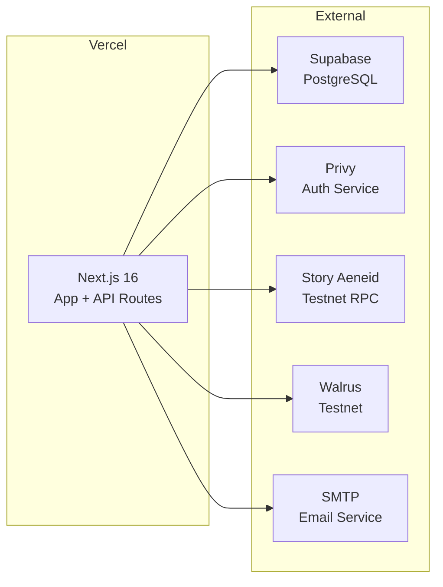

### Environment Variables

| Variable | Purpose | Required |
|---|---|---|
| `NEXT_PUBLIC_PRIVY_APP_ID` | Privy authentication | ✓ |
| `NEXT_PUBLIC_SUPABASE_URL` | Supabase project URL | ✓ |
| `NEXT_PUBLIC_SUPABASE_ANON_KEY` | Supabase anonymous key | ✓ |
| `SUPABASE_SERVICE_ROLE_KEY` | Supabase admin operations | ✓ |
| `NEXT_PUBLIC_CDR_NETWORK` | CDR network (testnet/mainnet) | Optional (default: testnet) |
| `NEXT_PUBLIC_WHITELIST_CONDITION` | WhitelistCondition contract address | ✓ |
| `NEXT_PUBLIC_ACCESS_CONDITION_V2` | AccessConditionV2 address | ✓ |
| `NEXT_PUBLIC_ACCESS_CONDITION_V3` | AccessConditionV3 address | ✓ |
| `SMTP_HOST`, `SMTP_PORT`, `SMTP_USER`, `SMTP_PASS`, `SMTP_FROM` | Email sending | Optional |

### Deployment Pipeline

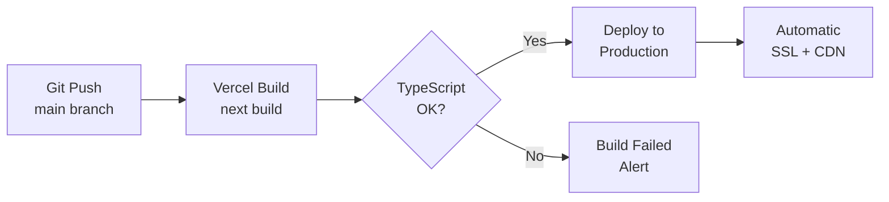

### Mainnet Migration Checklist
- [ ] Deploy contracts to Story mainnet
- [ ] Update `NEXT_PUBLIC_CDR_NETWORK` to `mainnet`
- [ ] Update RPC URL to mainnet endpoint
- [ ] Update Walrus to mainnet publisher/aggregator
- [ ] Update contract addresses in environment variables
- [ ] Run full regression test suite
- [ ] Update Privy to support mainnet chain
- [ ] Communicate migration to existing testnet users

---

## Appendix A: Glossary

| Term | Definition |
|---|---|
| **CDR** | Confidential Data Registry — Story Protocol's threshold-encrypted on-chain data storage |
| **Guardian** | A trusted contact designated to help recover a vault. They have independent, unilateral ability to recover the vault (1-of-N access model). |
| **Vault** | An encrypted container holding a secret (seed phrase, key, file, etc.) |
| **Threshold** | The minimum number of CDR network validator nodes required to reconstruct a key |
| **Walrus** | Decentralized blob storage network for encrypted files |
| **Privy** | Authentication provider supporting email and wallet login |
| **Whitelist** | On-chain list of addresses authorized to access a CDR vault |
| **Access Condition** | Smart contract that determines who can read/write a CDR vault |
| **Embedded Wallet** | A wallet created and managed by Privy for email users |

## Appendix B: References

| Resource | Link |
|---|---|
| Story Protocol | https://story.foundation |
| Walrus Storage | https://walrus.xyz |
| Privy Auth | https://privy.io |
| Shamir Secret Sharing (npm) | https://www.npmjs.com/package/shamir-secret-sharing |
| AES-GCM (NIST SP 800-38D) | https://csrc.nist.gov/publications/detail/sp/800-38d/final |
| Web Crypto API | https://developer.mozilla.org/en-US/docs/Web/API/Web_Crypto_API |

---

> **Document prepared by the Nythera Engineering Team**
> **Confidential — Do not distribute without authorization**
